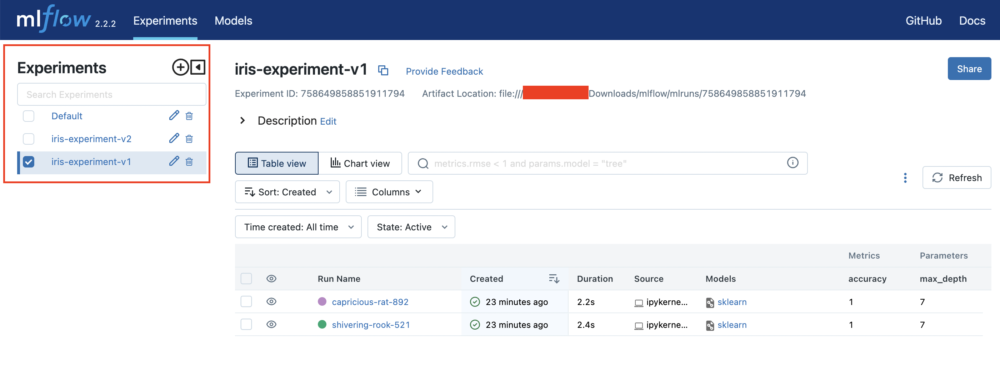
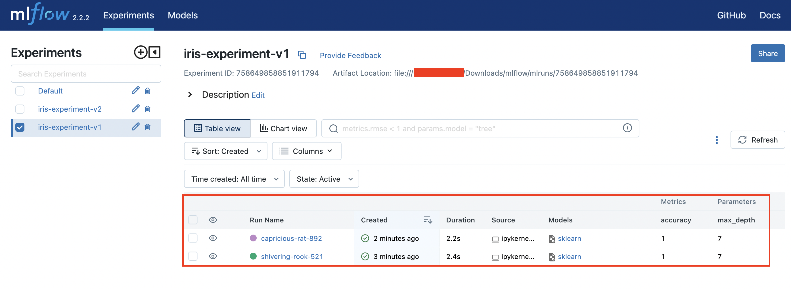

## MLflow: A Platform for Managing the Machine Learning Lifecycle

Machine learning has become an essential tool in many industries, but managing the machine learning lifecycle can be challenging. From tracking experiments to packaging code and sharing models, there are many tasks involved in creating and deploying machine learning applications. This is where MLflow comes in – a platform for managing the end-to-end machine learning lifecycle.


## MLflow Components

MLflow consists of four main components:

- **MLflow Tracking**: This component allows you to track experiments and results, so you can compare different runs of your machine learning code. MLflow Tracking logs parameters, metrics, and artifacts for each run, which makes it easy to reproduce and share results.

- **MLflow Projects**: This component allows you to package your code into reproducible runs, which can be shared and run in a consistent environment. MLflow Projects uses a simple YAML format to specify dependencies and parameters, so you can easily run your code in different environments.

- **MLflow Models**: This component allows you to package models as reusable artifacts, which can be downloaded and used for inference. MLflow Models supports a variety of machine learning frameworks, and makes it easy to deploy models to different environments.

- **MLflow Model Registry**: This component allows you to manage the lifecycle of your machine learning models, from development to deployment. MLflow Model Registry provides versioning, access control, and collaboration features, so you can manage models at scale.


## Getting Started with MLflow

To get started with MLflow, you can install it using pip:

```sh
pip install mlflow
```

Then, train an ML model

```sh
import mlflow.pyfunc
import pandas as pd

from sklearn.datasets import load_iris
from sklearn.ensemble import RandomForestClassifier
from sklearn.metrics import accuracy_score

# load dataset
iris = load_iris()
iris_train = pd.DataFrame(iris.data, columns=iris.feature_names)
iris_train.head(3)

# train model
clf = RandomForestClassifier(max_depth=7, random_state=0)
clf.fit(iris_train, iris.target)
```

Then, you can start tracking experiments by calling the `mlflow.start_run()` function:

```sh
import mlflow

# create experiment
experiment_name = "my-experiment"
try:
    mlflow.set_experiment(experiment_name)
except:
    mlflow.create_experiment(experiment_name)
    
# start a new MLflow run
with mlflow.start_run():
    # Log parameters
    mlflow.log_param("learning_rate", 0.01)
    # Log metrics
    mlflow.log_metric("accuracy", 0.93)
    # Log the model in MLflow
    mlflow.sklearn.log_model(clf, "my_model")
``` 

The `start_run()` function starts a new run, and any logged parameters, metrics, or artifacts will be associated with that run. You can then use the MLflow UI to visualize and compare different runs.

To launch the MLflow UI, simply run the command mlflow ui in your terminal. This will start the MLflow server and open the UI in your default web browser.

```sh
!mlflow ui --backend-store-uri file:mlruns --port 8908
```

Get logged model to make prediction

```sh
experiment = mlflow.get_experiment_by_name(experiment_name)
runs = mlflow.search_runs(experiment_ids=[experiment.experiment_id])

model_uri = r"mlruns/{}/{}/artifacts/my_model".format(experiment.experiment_id, runs['run_id'][0])
model = mlflow.pyfunc.load_model(model_uri)

# make predictions using the loaded model
predictions = model.predict(iris_train[1:3])

# print the predictions
print(predictions)
```

Finally, to manage the lifecycle of your models, you can use the MLflow Model Registry. To create a new model version, you can use the mlflow.register_model() function:

```
import mlflow

# Register a new model version
model_uri = "runs:/{}/my_model".format(runs['run_id'][0])
model_version = mlflow.register_model(model_uri, "MyModel")
```

This will create a new version of the model in the MLflow Model Registry, which can be accessed and deployed as needed.

To load a model from MLflow, you can use the mlflow.pyfunc.load_model() function:

```sh
import mlflow.pyfunc

# Load a model from MLflow
model_uri = "models:/MyModel/1"
model = mlflow.pyfunc.load_model(model_uri)
```

## Visualizing and Analyzing Experiments and Models with the MLflow UI

In addition to experiment tracking and model management, MLflow also provides visualizations to help you analyze and understand your experiments. The MLflow UI allows you to visualize metrics, parameters, artifacts, and models.

```sh
!mlflow ui --backend-store-uri file:mlruns --port 8908
```

Once you have launched the UI, you can navigate to the experiments page to view a summary of your experiments:



From the experiments page, you can drill down into individual runs to view their details, such as the metrics, parameters, and artifacts logged during the run:


You can also compare multiple runs to see how their metrics and parameters differ:

 Compare Runs Page

In addition to experiment tracking, the MLflow UI also allows you to visualize and manage your models. You can view a list of all registered models, along with their versions and metadata:

 

From the models page, you can also view detailed information about each model version, including the model's input and output schema, and the artifacts associated with the model:

  

In summary, the MLflow UI provides a powerful set of visualizations to help you analyze and understand your experiments and models. By using the UI to explore your data, you can gain insights into your machine learning workflows and identify opportunities for improvement.
